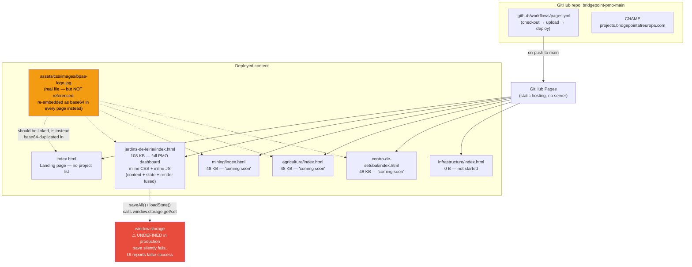

# BridgePoint PIOS — Repository Assessment

**Repo:** `bridgepoint-pmo-main` (deployed as `projects.bridgepointafreuropa.com`)
**Reviewed by:** Lead Software Engineer (Claude, Cowork)
**Date:** 2026-07-18
**Status:** Assessment only. No code has been modified. Awaiting approval before any change is made.

---

## 0. What this repository actually is

Before the 12-point review: this is **not** a build-tooled web application. It is a small set of hand-authored, self-contained static HTML files, deployed as-is to GitHub Pages via GitHub Actions. There is no framework, no bundler, no package manager, and no test suite. That's an important baseline — several "gaps" below (no build process, no dependency manager) are not oversights in a broken setup; they're the natural state of a zero-tooling static site. The real issues are duplication, one broken feature, and the absence of any shared layer between pages — all fixable by *extending* the existing plain-HTML approach, without introducing a framework or rewriting anything that works.

Total repository size: **344 KB**, 6 HTML files, 1 image, 1 GitHub Actions workflow.

---

## 1. Project Structure

```
bridgepoint-pmo-main/
├── index.html                      52 KB — landing page (no project list, by design)
├── jardins-de-leiria/index.html   108 KB — live PMO dashboard (only fully built project)
├── centro-de-setúbal/index.html    48 KB — "coming soon" placeholder
├── mining/index.html               48 KB — "coming soon" placeholder
├── agriculture/index.html          48 KB — "coming soon" placeholder
├── infrastructure/index.html        0 B  — empty file, not yet started
├── assets/
│   ├── index.html                   0 B  — empty
│   └── css/images/
│       ├── bpae-logo.jpg           35 KB — the one real shared asset
│       └── js/test.json             0 B  — orphaned test artifact
├── CNAME                           custom domain: projects.bridgepointafreuropa.com
├── README.md                       bilingual (PT/EN) operating instructions
└── .github/workflows/pages.yml     deploy-on-push-to-main via GitHub Pages Actions
```

Each top-level folder is one investor-facing project, isolated by URL (per the README's explicit "project isolation" model — a visitor with a project link cannot discover other projects from the landing page). That intent is sound and should be preserved.

## 2. Build Process

There isn't one. No `package.json`, no compiler, no minifier, no linter, no test runner. The GitHub Actions workflow (`pages.yml`) does exactly one thing: checkout → upload the repo root as-is → deploy to GitHub Pages. This is appropriate for the current scale, but it means every optimization (deduplicating the logo, sharing CSS/JS) either has to be done by hand in each file, or a very small build step needs to be introduced. Recommended in the roadmap below.

## 3. Dependencies

Zero. No npm packages, no CDN-hosted libraries, no fonts loaded externally. Everything — CSS, JS, even the logo — is embedded inline in each HTML file. This is a genuine strength from a supply-chain/security standpoint (nothing to patch, no transitive vulnerabilities), and it should be weighed carefully against any future recommendation to add tooling: the bar for pulling in a dependency should stay high.

## 4. Folder Organization

Matches the stated intent (one folder per project) and is easy to reason about. Two structural inconsistencies worth flagging:

- `assets/css/` contains no CSS — it contains the logo image and an empty `js/test.json`. The README describes `assets/css/` and `assets/js/` as reserved for "future shared use," but nothing currently references them.
- `infrastructure/index.html` and `assets/index.html` are 0-byte placeholder files already committed, which is a bit of hidden state — someone finding them in a file browser could reasonably assume they're broken rather than intentionally empty.

## 5. Component Reusability

This is the single biggest structural gap. There is currently **no shared component or partial of any kind** between pages:

- The header/logo/language-toggle markup is copy-pasted into all 5 non-empty HTML files.
- The three "coming soon" pages (`mining`, `agriculture`, `centro-de-setúbal`) are near-byte-identical to each other — same card, same button, same copy — differing only in the project title string. They are effectively one template that got duplicated three times.
- The design tokens (`--navy`, `--gold`, `--muted`, etc.) are redefined identically, inline, in every page's own `<style>` block.

None of this requires a framework to fix — it requires extracting what's already duplicated into shared files.

## 6. CSS Architecture

Every page ships its own `<style>` block (roughly 140–170 lines each) with no external stylesheet linked. The same CSS custom-property palette and layout rules are retyped per file. There's no naming convention (BEM, utility classes, etc.) — styles are hand-rolled ad hoc class names, which is fine at this size but won't scale past a handful more projects without drifting (e.g., a color tweak today has to be made in 5 places by hand). Only **one `@media` query** exists across the whole codebase, in the dashboard page.

## 7. JavaScript Architecture

Also entirely inline, vanilla JS, no modules, no framework. In `jardins-de-leiria/index.html` (~740 lines of script) three concerns are fused together in one blob:

1. **Content** — the PT/EN translation strings and every table row (roles, deliverables, risks, actions, documents) are hardcoded as JS object literals.
2. **State** — a single mutable global object (`S`) holds live UI state, seeded from a `DS` default and mutated directly by click handlers.
3. **Rendering** — DOM is rebuilt via manual string templating (`renderAll()`), not diffed or componentized.

This works today because there's one dashboard, but it means adding a second real dashboard means copy-pasting this entire 740-line block and re-editing content by hand inside JS syntax — a genuine "shouldn't be a page author to enter a project" barrier for a PMO tool.

**Critical defect found:** the save/load functions call `window.storage.get()` / `window.storage.set()` — an API that does not exist in a standard web browser:

```js
const r = await window.storage.get(STORE_KEY);   // loadState()
await window.storage.set(STORE_KEY, JSON.stringify(S));  // saveAll()
```

`window.storage` is undefined on the deployed GitHub Pages site (it appears to be a leftover reference to a sandboxed AI-preview environment's storage polyfill, never adapted for production). Both calls throw immediately. `loadState()` swallows the error silently (`catch(e){}`), so the dashboard always boots from defaults. `saveAll()` also swallows the error but still shows the green "Progresso guardado ✓" toast — **the UI actively tells the user their edits were saved when nothing was persisted.** Every status update, risk note, or deliverable check-off entered on the live site is lost on refresh, with no indication to the user that this happened. This is the highest-priority item in the risk assessment below.

## 8. Performance

The repo is small in absolute terms (344 KB), but a large share of it is avoidable duplication:

- The 35 KB logo already exists as a real file (`assets/css/images/bpae-logo.jpg`), yet it is *also* embedded as a base64 data URI (≈47 KB of inline text, base64's ~33% overhead) directly inside **5 of the 6 HTML files**. That's roughly 235 KB of the repo's 344 KB — over two thirds — spent re-encoding the same logo six times over, uncached, on every single page load.
- Because the image is inline rather than linked, the browser cannot cache it once across pages; every project page pays the full logo cost again.

## 9. Accessibility

- **Zero** `aria-*` attributes and **zero** `role` attributes anywhere in the codebase.
- **Zero** `tabindex` usage — keyboard navigation through tabs, editable status cells, and the save button has not been explicitly considered.
- `<html lang="pt">` is hardcoded and never updated when the user toggles to English via the in-page language switcher — a screen reader will keep announcing Portuguese content as Portuguese even after the visible text switches to English.
- Status is communicated primarily through color (green/amber/red/blue) — this is partially mitigated by each status also carrying a text label (e.g. "✓ Concluído" / "○ Em Falta"), which is good practice, but no accessibility pass has been done to confirm contrast ratios or screen-reader table semantics.

## 10. Security

- `<meta name="robots" content="noindex, nofollow">` is present on the dashboard and placeholder pages — a reasonable first layer against search-engine exposure.
- No secrets, API keys, or credentials were found anywhere in the repo (verified by search) — no external network calls exist either. The near-total absence of third-party code is a genuine strength.
- However, there is **no authentication or access control of any kind**. The README explicitly documents the security model as "project isolation" — i.e., a visitor can only see a project if they have its exact URL, since the landing page never links to it. That is obscurity, not access control. GitHub Pages content is public to anyone with the link, permanently, regardless of `robots` directives (which only ask well-behaved crawlers not to index — they do nothing to stop a forwarded link, a browser cache, or a scraper that ignores robots.txt). The dashboard contains named individuals, project financials-in-progress, and risk registers — content an investor-relations tool would normally want gated behind at least a shared password or link expiry, especially since (per objective 7) this system is meant to grow into something AI-driven and likely handling more sensitive data over time.

## 11. Responsiveness

The viewport meta tag is present, layout uses `flex-wrap` and a `max-width: 1140px` centered container, and the tab bar uses `overflow-x: auto` so it doesn't break on narrow screens. This is reasonable, low-effort mobile consideration for a hand-rolled page, but it rests on a single `@media` query in the entire codebase — real mobile behavior (small-screen table layouts in particular, which are dense multi-column data tables) has not been verified against actual breakpoints and should not be assumed solid.

## 12. Technical Debt (summary)

Ranked by how much duplicated effort it currently costs, not yet by risk (see Risk Assessment):

1. Logo duplicated 5x as base64 instead of referencing the one real file that already exists.
2. Entire CSS design system (tokens, header, tabs, tables, buttons) duplicated verbatim across every page.
3. "Coming soon" template duplicated 3x with only the title string differing.
4. Content, translations, and rendering logic fused into one 740-line inline script with no separation — adding a second dashboard means hand-copying and re-editing all of it.
5. `window.storage` calls reference an API that doesn't exist in production — the save feature is currently non-functional and silently misleads the user.
6. `assets/css/` naming doesn't match its contents (images, not CSS); `assets/js/` referenced in the README doesn't exist yet.

---

## Architecture Diagram (current state)



---

## Risk Assessment

| # | Risk | Area | Severity | Likelihood | Notes |
|---|------|------|----------|------------|-------|
| 1 | Save/load uses `window.storage`, undefined in production — edits are silently lost, UI falsely confirms "saved" | Functional / Data integrity | **Critical** | Certain (already occurring on every save) | Undermines the tool's entire purpose — a PMO tracker that can't persist status |
| 2 | No access control on investor/financial data — obscurity-only "isolation" model | Security | **High** | Medium (depends on link handling discipline) | Named individuals, financials-in-progress, risk registers are one forwarded link away from exposure |
| 3 | `html lang="pt"` never updates on language toggle | Accessibility / i18n | Medium | Certain | Misleads screen readers and translation tools for EN-language visitors |
| 4 | Zero ARIA/tabindex coverage on interactive tabs, editable cells, save button | Accessibility | Medium | Certain | Excludes keyboard/screen-reader users entirely from editing the dashboard |
| 5 | Logo + CSS + JS duplicated across every page | Maintainability / Performance | Medium | Certain (already occurring) | Every content or branding change requires hand-editing 5 files identically; error-prone |
| 6 | Content/state/render logic fused in one script | Maintainability | Medium | Grows with each new project added | Each new dashboard currently means copy-pasting ~740 lines of JS and hand-editing embedded data |
| 7 | No tests, no build validation | Process | Low–Medium | N/A | Any future refactor has no safety net to confirm nothing broke |
| 8 | Empty placeholder files committed (`infrastructure/index.html`, `assets/index.html`) | Housekeeping | Low | N/A | Cosmetic, but ambiguous to a new contributor |

---

## Improvement Roadmap

Ordered to preserve everything that works, extend rather than rewrite, and reduce risk before reducing debt. No framework migration is proposed — the plain-HTML approach is appropriate at this scale and should stay, just with a thin shared layer added underneath it.

**Phase 0 — Fix the one thing that's actually broken (no architecture change)**
Replace the `window.storage` calls with a real persistence mechanism (start with `localStorage`, which requires almost no code change and immediately makes the save button honest). This is the only item that should happen before anything else, because right now every user of the live dashboard is silently losing their work.

**Phase 1 — Deduplicate what already exists (extend, don't restructure)**
Point every page at the one real logo file instead of re-embedding it as base64 six times. Extract the shared CSS design tokens and component styles into a single `assets/css/shared.css`, linked from each page instead of copy-pasted. This alone removes the majority of the repo's duplicated weight without touching any working feature.

**Phase 2 — Turn the "coming soon" template into one real template**
Since three placeholder pages are already byte-for-byte identical except for a title string, consolidate them into one small shared snippet (even a tiny build-time include is enough — no framework needed) so a new project's placeholder page is a one-line change, not a 48 KB copy-paste.

**Phase 3 — Separate content from behavior in the dashboard**
Move the hardcoded translation strings and seed data (`T`, `DS`) out of the inline script and into JSON files loaded by a small shared JS module. This is the step that most directly serves objective 7 (preparing for future AI-driven modules): once project data lives in a clean, structured JSON shape rather than embedded JS literals, an AI module can read or write it without needing to parse HTML/JS source.

**Phase 4 — Accessibility pass**
Add `aria-selected`/`role="tab"` to the tab bar, `tabindex` where needed, fix the `html lang` toggle, and verify contrast/keyboard flows — additive changes, no structural risk.

**Phase 5 — Access control**
Introduce at minimum a shared-password or signed-link gate in front of project folders before any more sensitive project data goes live, since the current "isolation by unlisted URL" model is not real access control.

**Phase 6 — Light process hygiene**
Add a minimal build/lint step to the GitHub Actions workflow (even just an HTML validator and a check that no page exceeds a size budget) so future duplication regressions are caught automatically rather than by manual review.

---

## What's next

This document is assessment only — nothing in the repository has been changed. Let me know which phase(s) you'd like to approve and I'll implement them incrementally, starting with Phase 0 (the broken save feature) if you agree that's the priority.
